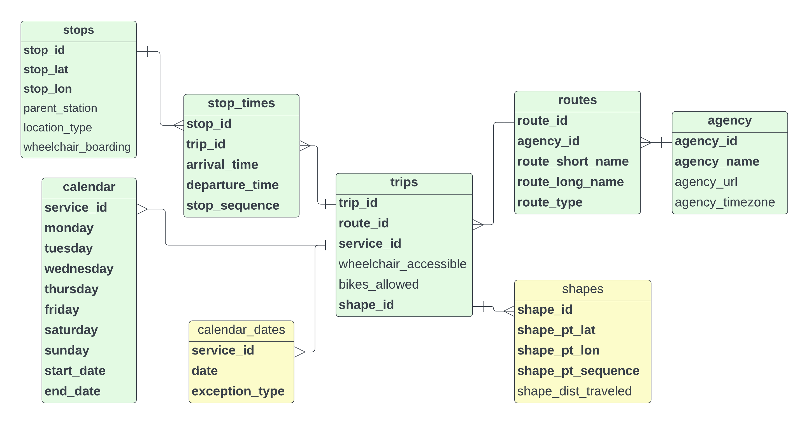

*****************************************
GTFS Public Transit Data
*****************************************

The source data used to calculate the Transit Accessibility Index is General Transit Feed Specification (GTFS),
made publicly available through the Mobility Database Catalog by contributing public transit agencies.
`Conceived by Google and Portland TriMet`_ and now adopted by the US Department of Transportation
(`National Transit Database Reporting Changes, 2022`_), GTFS is a standardized data schema for transit agencies to
provide access to information about their services.

:numref:`GTFS ERD` details the GTFS resources used to calculate the Transit Accessibility Index. Traversing this
schema can be daunting at first. This diagram is nowhere near all inclusive, but it does help to understand and navigate
the relationships between GTFS tables used to cal create the Transit Accessibility Index. The
`GTFS schema documentation`_ provides details on the full set of optional columns and tables.

.. _GTFS ERD:

    GTFS Schema Entity Relationship Diagram

To get the routes serving a stop, it is necessary to traverse through ``stop_times`` and ``trips`` to
retrieve related routes. Similarly, to know whether a stop has service on a weekday, it is necessary to traverse
``stop_times`` and ``trips`` to retrieve if service is available on a given day from ``calendar``. When initially
attempting to understand the input GTFS data, :numref:`GTFS ERD` is extremely useful.

Data Inferencing
=================

The GTFS specification is deliberately very flexible to meet the varied needs of transit agencies. When attempting to
create a consistent measure of transit accessibility, the Transit Accessibility Index, this is somewhat challenging
since data may be presented differently depending on the agency providing the data. Calculating the Transit
Accessibility Index requires mitigating challenges presented by these variations in two specific cases, a missing
``calendar`` file and missing ``stop_times`` arrival times.

Missing Calendar File
---------------------

The Transit Accessibility Index assesses transit quality by determining service offered by day of the week. This is
derived from a file defined in the GTFS specification, the ``calendar`` file (:numref:`calendar`). It is quite simple,
a boolean column for each day of the week offering service. Each row can be associated back to routes, trips and stops
using a unique identifier, ``service_id`` (:numref:`GTFS ERD`).

.. _calendar:

.. csv-table:: Example Calendar File Contents
    :file: ./assets/calendar.txt
    :widths: 28, 8, 8, 8 ,8 ,8 ,8 ,8 ,8 ,8
    :header-rows: 1

The GTFS specification also includes another file detailing service days, the ``calendar_dates`` file. Ideally, only
service exceptions, when service is removed for holidays and other unique circumstances, is detailed in the
``calendar_dates`` file, but some agencies opt to list all service days in ``calendar_dates`` and omit ``calendar``
completely.

The ``calendar_dates`` file is comprised of only three columns; a column with the unique identifier for the service
offered (relates back to trips,routes, and stops), a column with the date of service, and the exception type (*1*
for service added and *2* for service removed). In the aforementioned ideal scenario, the ``calendar`` file is
included detailing regular service, and ``calendar_dates`` only details service exceptions (exception type *2*) along
with some routes added for special events and holidays (exception type *1*) as shown in :numref:`calendar_dates_2`.

.. _calendar_dates_2:

.. csv-table:: Calendar Dates with Service Exceptions
    :file: ./assets/calendar_dates_2.txt
    :widths: 18, 8, 8
    :header-rows: 1

However, according to the GTFS specification, is allowed to simply list *all* service explicitly in the
``calendar_dates`` file and omit the ``calendar`` file. In this case, most of the entries are an exception type *1*
(:numref:`calendar_dates_1`).

.. _calendar_dates_1:

.. csv-table:: Calendar Dates with All Service
    :file: ./assets/calendar_dates_1.txt
    :widths: 8, 8, 8
    :header-rows: 1

In these instances, as part of validation, a ``calendar`` file is constructed by interrogating the ``calendar_dates``
file using the following logic.

1. exception type ``1`` records are selected
2. day of week is calculated from the dates listed offering service
3. if, by service identifier, any day of the week offers service, then for this service identifier, this day of the week is deemed to be ``true``...offering service

This constructed ``calendar`` file is added to the validated data, and enables determining day of week service offered
for routes, trips and stops.

Missing Arrival Times
---------------------

Time of day service (daytime, evening and overnight) for each transit stop is determined based on the stop time for
trips at each stop. The GTFS specification allows for null stop times provided there is at least a starting and ending
time for each trip. Individual stop times for each stop do not *have* to be listed...provided the starting and ending
time are provided. It is not uncommon to also see every nth stop with an arrival time, every fourth or sixth stop in
a trip. This can be problematic when determining daytime, evening and overnight service metrics for the stops
(:numref:`stop_times`).

.. _stop_times:

.. csv-table:: Stop Times with Missing Values
    :file: ./assets/stop_times.txt
    :widths: 8, 8, 8, 8 ,8
    :header-rows: 1

This is mitigated by inferencing the values between known times. Although inferencing does not take into consideration
the route traveled and the potential differences in time due to varied distance between intermediate stops,
inferencing arrival times based on known start and end times does ensure each stop has an arrival time. These
inferenced arrival times, while not perfect based on distance traveled, since equally distributed between known starting
and ending times, do enable accurate determination of daytime, evening and overnight service boolean columns. It
also enables calculating headway descriptive statistics for evaluating service quality. Hence, for the purposes of
calculating the Transit Accessibility Index, this is more than sufficient.

References
##########

* `A Gentle Introduction to Sigmoid Function`_
* `Mobility Database Catalogs Repo`_
* `Google Transit GTFS Static Overview`_
* `Transit Accessibility Score`_ (Excel)
* `Transit Access Presentation`_ (PowerPoint)
* `Transit Accessibility Index Project Charter`_ (Word)
* `Desmos With Sigmoid Formula`_ (useful for exploring modifying the sigmoid curve)

.. _typical walking distance to transit: https://safety.fhwa.dot.gov/ped_bike/ped_transit/ped_transguide/ch4.cfm
.. _A Gentle Introduction to Sigmoid Function: https://machinelearningmastery.com/a-gentle-introduction-to-sigmoid-function
.. _Waldo R. Tobler, 1970: https://www.jstor.org/stable/143141
.. _Conceived by Google and Portland TriMet: https://gtfs.org/background/
.. _National Transit Database Reporting Changes, 2022: https://www.federalregister.gov/documents/2022/07/07/2022-14502/national-transit-database-reporting-changes-and-clarifications
.. _Mobility Database Catalogs Repo: https://github.com/MobilityData/mobility-database-catalogs
.. _Google Transit GTFS Static Overview: https://developers.google.com/transit/gtfs
.. _GTFS schema documentation: https://gtfs.org/schedule/reference/#gtfs-schedule-reference
.. _Status of the Nation's Highways, Bridges, and Transit, 2002: https://www.fhwa.dot.gov/policy/2002cpr/ch14.cfm
.. _Transit Accessibility Score: https://esriis.sharepoint.com/:x:/r/sites/TransitScore/Shared%20Documents/General/spreadsheets/Transit%20Accessibility%20Score.xlsx?d=w5a38118638e7462fafc408b852d51633&csf=1&web=1&e=JtX9Qg
.. _Transit Access Presentation: https://esriis.sharepoint.com/:p:/r/sites/BADataEngineering-Internship/Shared%20Documents/General/Data/Transit%20Access%20PowerPoint.pptx?d=w5d8aa83cdc1a4d9f9cf2b13c76831d5e&csf=1&web=1&e=MPH6Vm
.. _Transit Accessibility Index Project Charter: https://esriis.sharepoint.com/:w:/r/sites/TransitScore/Shared%20Documents/General/documents/BA%20Transit%20Score%20Project%20Charter.docx?d=wf5b7ac1f8b784b6abdaefbd9d4d704cd&csf=1&web=1&e=Ljtoeq
.. _Desmos With Sigmoid Formula: https://www.desmos.com/calculator/xuokc7ysqo
.. _Average function from the NumPy module: https://numpy.org/doc/stable/reference/generated/numpy.average.html
.. _O'Sullivan and Morrall, 1996: https://journals.sagepub.com/doi/pdf/10.1177/0361198196153800103#:~:text=Walking%20routes%20to%20LRT%20stations,direct%20unobstructed%20distance%20
.. _Cui, DeWeese, Wu, et al., 2022: https://www.sciencedirect.com/science/article/pii/S0966692322000175
.. _Winsorizing: https://en.wikipedia.org/wiki/Winsorizing