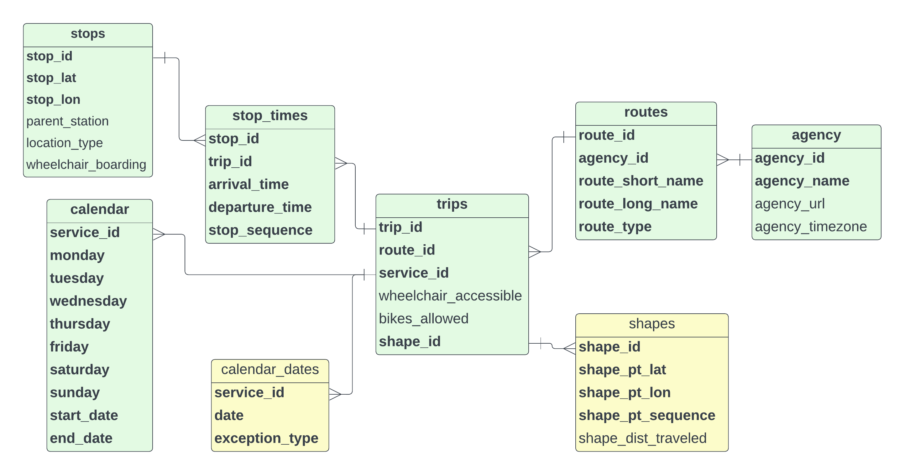

# GTFS Overview

The source data used to calculate the Transit Accessibility Index is General Transit Feed Specification (GTFS),
made publicly available through the Mobility Database Catalog by contributing public transit agencies.
[Conceived by Portland TriMet](https://gtfs.org/background/), popularized by Google, and now 
[adopted as a standard by the US Department of Transportation](https://www.federalregister.gov/documents/2022/07/0/2022-14502/national-transit-database-reporting-changes-and-clarifications), 
GTFS is a standardized data schema for transit agencies to provide service information.

The [GTFS standard](https://gtfs.org/documentation/overview/) defines two specifications, Realtime and Schedule. GTFS Realtime 
is a specification for providing near real time information to users. GTFS Schedule is a specification for providing static
public transportation information. The latter, GTFS Schedule, is what GTFS-Tools is designed to work with.

## GTFS Schedule Schema

The entity relationship diagram (ERD) above details the GTFS resources travered and used to create stop and line features detailing
transit stops and routes. This diagram is nowhere near all inclusive. The full
[GTFS schema documentation](https://gtfs.org/schedule/reference/#gtfs-schedule-reference) provides all the details of available 
for a GTFS schedule dataset.

The GTFS ERD does not include all the optional fields and nowhere near all the files, which can be included in a GTFS 
dataset. Still, it helps in understanding the relationships between GTFS tables to get the information needed from 
a GTFS dataset. 

For instance, to get the routes serving a stop, it is necessary to traverse through `stop_times` and `trips` to
retrieve related routes. Similarly, to know whether a stop has service on a weekday, it is necessary to traverse
`stop_times` and `trips` to retrieve if service is available on a given day from `calendar`. When initially
attempting to understand the input GTFS data, the GTFS ERD is extremely useful.

The GTFS specification is deliberately very flexible to meet the varied needs of transit agencies. When attempting to
create combined features from disparate datasets, this flexibility is somewhat challenging since data varies depending 
on the agency providing the data. Creating a consistent schema requires mitigating challenges presented by these variations.
Exploring and evaluating the variations, and mitigating the variations of between GTFS datasets is the reason for the 
creation of GTFS-Tools.

## Inferencing

Specifically, there are two common cases where missing data, while accepatable based on GTFS standards, presents challenges
for deriving more information about features, a missing `calendar` file and missing arrival times in `stop_times`.

### Missing Calendar File

Determining service offered by day of the week is defined in the `calendar` file. However, this is conditionally an optional
file according to the GTFS specification. The calendar file is quite simple, a boolean column for each day of the week offering 
service. Each row can be associated back to routes, trips and stops using a unique identifier, `service_id`.

| service_id                   |   monday |   tuesday |   wednesday |   thursday |   friday |   saturday |   sunday |   start_date |   end_date |
|:-----------------------------|---------:|----------:|------------:|-----------:|---------:|-----------:|---------:|-------------:|-----------:|
| AFA23GEN-1038-Sunday-00      |        0 |         0 |           0 |          0 |        0 |          0 |        1 |     20231217 |   20240616 |
| AFA23GEN-1039-Saturday-00    |        0 |         0 |           0 |          0 |        0 |          1 |        0 |     20231223 |   20240622 |
| AFA23GEN-1092-Weekday-00_C45 |        1 |         1 |           1 |          1 |        1 |          0 |        0 |     20231218 |   20240621 |

The GTFS specification also includes another file detailing service days, the `calendar_dates` file. Ideally, only
service exceptions, when service is removed for holidays and other unique circumstances, is detailed in the
`calendar_dates` file, but some agencies opt to list all service days in `calendar_dates` and omit `calendar`
completely.

The `calendar_dates` file is comprised of only three columns; a column with the unique identifier for the service
offered (relates back to trips,routes, and stops), a column with the date of service, and the exception type (*1*
for service added and *2* for service removed). In the aforementioned ideal scenario, the `calendar` file is
included detailing regular service, and `calendar_dates` only details service exceptions (exception type *2*) along
with some routes added for special events and holidays (exception type *1*) as shown in :numref:`calendar_dates_2`.

|   service_id |     date |   exception_type |
|-------------:|---------:|-----------------:|
|            1 | 20240210 |                1 |
|            1 | 20240211 |                1 |
|            1 | 20240217 |                1 |
|            1 | 20240218 |                1 |
|            1 | 20240219 |                1 |
|            1 | 20240224 |                1 |
|            1 | 20240225 |                1 |
|            1 | 20240302 |                1 |
|            1 | 20240303 |                1 |
|            1 | 20240309 |                1 |

However, according to the GTFS specification, is allowed to simply list *all* service explicitly in the
`calendar_dates` file and omit the `calendar` file. In this case, most of the entries are an exception type *1*.

| service_id                   |     date |   exception_type |
|:-----------------------------|---------:|-----------------:|
| AFA23GEN-1038-Sunday-00      | 20231225 |                1 |
| AFA23GEN-1038-Sunday-00      | 20240101 |                1 |
| AFA23GEN-1038-Sunday-00      | 20240527 |                1 |
| AFA23GEN-1039-Saturday-00    | 20240219 |                1 |
| AFA23GEN-1092-Weekday-00_C45 | 20231225 |                2 |
| AFA23GEN-1092-Weekday-00_C45 | 20240101 |                2 |
| AFA23GEN-1092-Weekday-00_C45 | 20240212 |                2 |
| AFA23GEN-1092-Weekday-00_C45 | 20240213 |                2 |
| AFA23GEN-1092-Weekday-00_C45 | 20240219 |                2 |
| AFA23GEN-1092-Weekday-00_C45 | 20240527 |                2 |

In these instances a calendar table is constructed in memory by interrogating the `calendar_dates`
file using the following logic.

1. Exception type `1` records are selected.
2. Day of week is calculated from the dates listed offering service.
3. If, by service identifier, any day of the week offers service, then for this service identifier, this day of 
  the week is deemed to be `True` for the `service_id` in the calendar table.

This constructed `calendar` table enables determining day of week service offered for routes, trips and stops.

### Missing Arrival Times

| trip_id     |   stop_sequence | stop_id   | arrival_time   | departure_time   |
|:------------|----------------:|:----------|:---------------|:-----------------|
| PART1-07-02 |              34 | 1a062OC   | 10:08:00       | 10:08:00         |
| PART1-07-02 |              35 | ectd      | <NA>           | <NA>             |
| PART1-07-02 |              36 | PT_113504 | 10:10:00       | 10:10:00         |
| PART1-07-01 |               6 | 2729oc    | 08:20:00       | 08:20:00         |
| PART1-07-01 |               7 | PT_113543 | <NA>           | <NA>             |
| PART1-07-01 |               8 | PT_113535 | 08:23:00       | 08:23:00         |

Various metrics can be derived from `stop_times` _if this table is complete_. These include time of day service is
provided at a stop. From this time, it can be determined if a stop, trip and route provide service during specific
notable temporal windows such as early morning (before 05:00), late night (after 21:00), morning peak (07:00-09:00),
evening peak (16:00-19:00) and midday (09:00-16:00). The GTFS specification allows for null stop times in `stop_times`
provided there is at least a starting and ending time for each trip. Individual stop times for each stop do not 
_have_ to be listed...provided the starting and ending time are provided. It is not uncommon to also see every nth 
stop with an arrival time, every fourth or sixth stop in a trip. While allowed by the GTFS specification, it makes
processing and analysis difficult since specific stops do not have times associated with them.

This is mitigated by inferencing the values between known times. Although inferencing does not take into consideration
the route traveled and the potential differences in time due to varied distance between intermediate stops,
inferencing arrival times based on known start and end times does ensure each stop has an arrival time. These
inferenced arrival times, while not perfect based on distance traveled, since equally distributed between known starting
and ending times, do enable accurate determination of daytime, evening and overnight service boolean columns. It
also enables calculating headway descriptive statistics for evaluating service quality.
